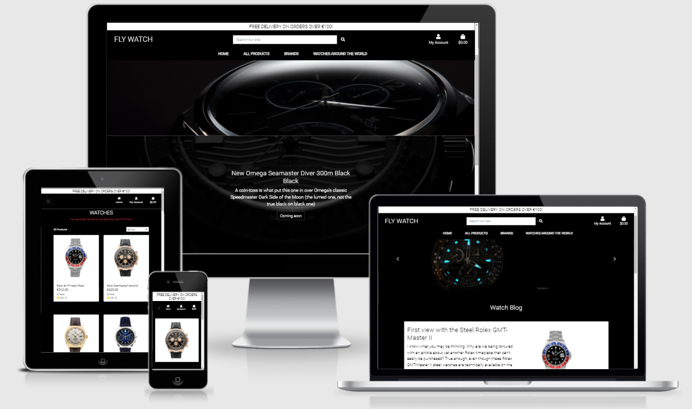
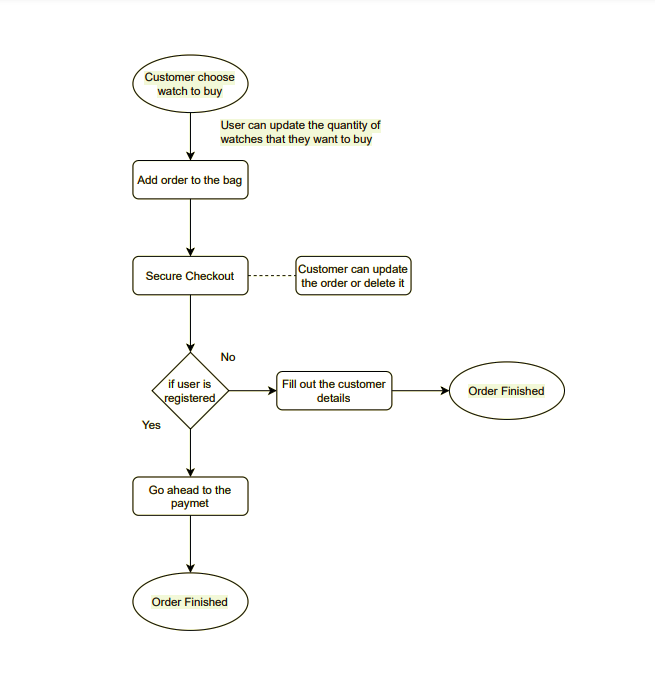
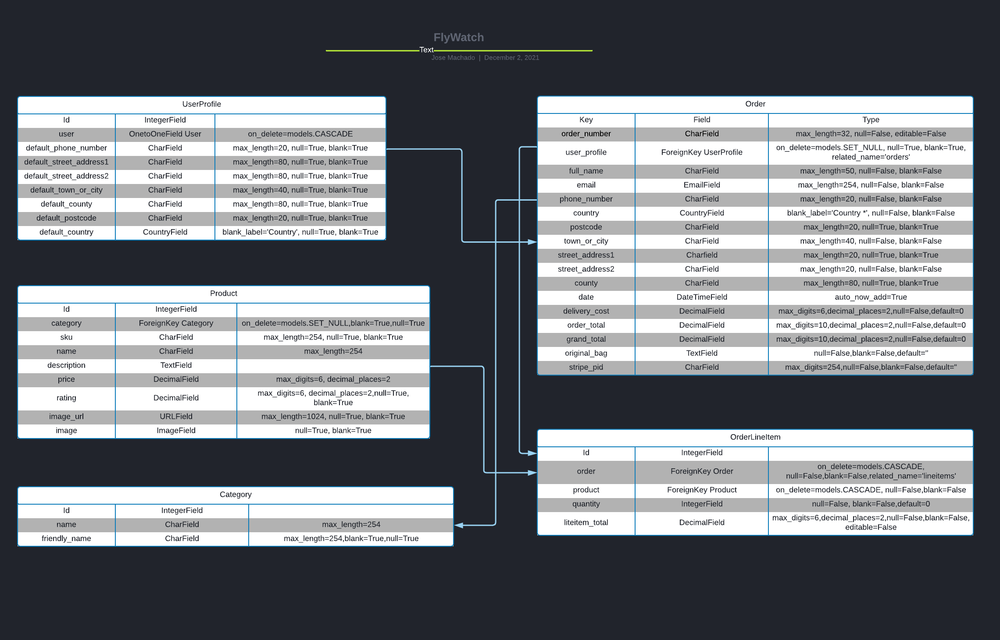
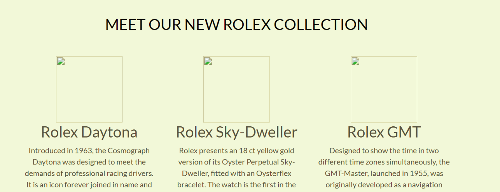

# **FlyWatch**

## **FlyWatch** 

Welcome to FlyWatch.

Come to our website to find the most exclusives watches in the market.
It works with Stripe to make the process easier and safer.

This is not an online store therefore, it will not process any order.
It's the final project from the code institute software development course.

If you have any feedback or questions, head over to my GitHub contact details and feel free to reach out to me.

---

## Table of contents 
* [UX](#ux)
    * [User Goals](#user-goals)
    * [User Stories](#user-stories)
    * [Site Owners Goals](#site-owners-goals)
    * [User Requirements and Expectations](#user-requirements-and-expectations)
        * [Requirements](#requirements)
        * [Expectations](#expectations)
    * [Design Choices](#design-choices)
        * [Fonts](#fonts)
        * [Colors](#colors)
        * [Structure](#structure)
* [Wireframes and Flowcharts](#wireframes-and-flowcharts)
    * [Wireframes](#wireframes)
    * [Flowcharts](#flowcharts)
    * [Database Structure](#database-structure)
* [Features](#features)
    * [Existing Features](#existing-features)
    * [Features to be implemented](#features-to-be-implemented)
* [Technologies used](#technologies-used)
    * [Languages](#languages)
    * [Libraries and Frameworks](#libraries-and-frameworks)
    * [Tools](#tools)
* [Testing](#testing)
* [Bugs](#bugs)
* [Deployment](#deployment)
    * [Local Deployment](#local-deployment)
    * [Heroku Deployment](#heroku-deployment)
* [Credits](#credits)

--- 

## **UX**

### **User Goals**

The home page should be very attractive in order to take the possible customer to an order.
The webstore should work well on all devices.
The webstore should contain information of all producuts shown.
The payment should be easy, quick and safe.

### **User Stories**

As a user:

A user wants the webstore to be very attractive so they can make an order.
A user wants to have information on the products that is shown on the webstore.
A user wants to see any sale either on the product or for delivery.
A user wants to make a payment online with credit cards.
A user wants to look for watches based on price, brand or other category.

### **Site owners Goals**

As an owner:

The owner wants to sell the products available on the webstore.
The owner wants to make the webstore popular on the internet.
The owner wants to see all the orders made through the website.
The owner wants to be able to upload or delete a products on their website.
The owner wants to the possibility of updating a product on the website.

### **User Requirements and Expectations**

#### Requirements

The webstore has to be easy to be navigated on.
The webstore have to have colors with contrast.
The products on the website have to easy to be found.
Images of the products have to be up to date.

#### Expectations

The webstore will not have broken pages when displayed in differents devices such as tablets, iphones and laptops.
The webstore has to have its links working and that the links take the customer to the right and expected place.
Webstore is in line with the customer's journey.
The website has show the products prices and the prices updated when the customer change their order.

### **Design Choices**

The main colours of the webstore is black and white. 

I used the [Coolors](https://coolors.co/ "Coolors.co") to come up with the color pallette.

#### Colors

Main colors used for the webstore is:

- White (#fff)
- Black (#000)

Other than these main colors there are a few other colors that dont make huge difference to the website.

#### Fonts

The font used for this website was the 'Roboto' from [Google Fonts](https://fonts.google.com/ "Google Fonts").

#### Structure

The webstore will start with the land page which contains the navigation on top of the background image.
Other than land page, the website also has the following pages:

* ### Home Page
    The home page is the main page of the project. It has to big pictures on the background of the website. It has an appealing design which can bring possible customers to an order.

* ### All Products
    It's a page with all the products that the website can offer the customers. The user can also filter the search by price, rating and brands.

* ### Brands
    It's a page that takes the customer to a specific chosen brand by the customer.

* ### Watches Around the World
    This page is a mini blog which contains more details about 3 specific products.

* ### Product detail
    This page is a page with the specific details of a product chosen by the customer.

* ### Bag
    This page has the products details along the price and delivery information. The customer can also update the order or delete it. 

* ### Checkout
    This page the customer can go ahead the their order and place the order.

## **Wireframes and Flowcharts**

### **Wireframes**
I have used [Balsamic](https://balsamiq.com/wireframes/) to create wireframes for my webstore.
[Landing / Home page](wireframes/home.png) 

### **Flowcharts**

To make the flowchart for the purchasing process I decided to use [Draw.io](https://draw.io/). The picture is down here below.

### **Database Structure**

For the project I set up 12 database Models which you can see in the image below. 
I have highlighted the relationships between the various models.

## **Features**

### **Existing Features**

* Registration and Sign in function through allauth package from Django
* 2 big background images on the home page to call the customer attention
* A small blog with a few products to add more value to the webstore
* Checkout page that allows customer to place an order
* The add products function that makes a superuser add or delete a product to the webstore.

The user can also check the order history to check the previous orders that they have made.

There is a function in the bag that saves the products that were not bought through cache.

### **Features to be implemented**

* A super promotion that calculates and shows on the screen depending on the number of items that are being putting in the bag.
* A function that finds the prices of watches from different places and try to show the product price depending on the actual store income.
* A function that takes the photo of customer wrist and show a picture of the customer wearing the watch on the screen.

## **Technologies used**

* [HTML](https://en.wikipedia.org/wiki/HTML)
* [CSS](https://en.wikipedia.org/wiki/Cascading_Style_Sheets)
* [JavaScript](https://en.wikipedia.org/wiki/JavaScript)
* [Python](https://www.python.org/)

### **Libraries and Frameworks**

* [Font Awesome](https://fontawesome.com/)
* [Bootstrap](https://getbootstrap.com/)
* [Google Fonts](https://fonts.google.com/)
* [jQuery](https://jquery.com/)
* [Stripe](http://stripe.com/)

### **Tools**

* [Django](https://www.djangoproject.com/)
* [Git](https://git-scm.com/)
* [GitPod](https://www.gitpod.io/)
* [Heroku](https://www.heroku.com/)
* [Balsamic](https://balsamiq.com/wireframes/)
* [W3C HTML Validation Service](https://validator.w3.org/)
* [W3C CSS Validation Service](https://jigsaw.w3.org/css-validator/)

## Testing

## Table of contents 
* [Homepage](#homepage)
* [Products](#rooms)
* [Checkout](#reservation)
* [Profile](#profile)
* [Navigation](#navigation)
* [Footer](#footer)
* [Reservations overview for Admin ](#reservations-overview-for-admin)

I have tested all the html files using [HTML Validator](https://validator.w3.org/).
I have tested all the CSS files using  [CSS Validator](https://jigsaw.w3.org/css-validator/).
I have tested all the JS files using [Javascript Validator](https://jshint.com/).

## Homepage
### **Responsiveness**
#### Where did I test?
I have tested the homepage on a few devices using inspect.
I have also tested how the home page display on microsoft edge and google chrome.

#### What did I test?
* Quality and display of hero image
* Display of carousel  
* Products on the bottom of the page

#### Conclusion
The 2 background images look good in all devices.
The carousel image from the blog page looks also good.  
The carousel from the blog page will not display on small screen which looks good.
Carousel resizes the height depending of the content of the slide.
The products on the bottom of the page had their url wrong. I have fixed the code adding the right url to them so they could show on the homepage.

 

### **Functionality**
Button 'Coming soon' on the home page works as it is expected to work taking the customer to the products page. 
Disabled carousel on the blog page for small screens. It looks better on big screens.  

The right/left carousel arrows work as it is expected to work. There are 2 pictures in this carousel.

### **User Experience**
#### User Story: The webstore has to be attractive so the customer can see themselves wearing the watches.
The big and close background image on the home pages gives the "fancy" feeling to the customer which can give high changes to a probable order.
When the user scroll down there is a second image that overflow the other image and gives the customer that feeling of surprise.

#### User Story: I want to have know some history about the products
There is a page on the webstore which is a small blog with a few products on it. It tells the story of specific products and it makes the customer feel a bit closer to the webstore.

## Products
### Responsiveness
#### Where did I test?

I have tested the page with the home products on all types of devices such as Desktop, tablet and iphone.

#### What did I test?
* The quality of the watches displayed on the products page
* Responsiveness of the additional information text

#### Conclusion
The products that are displayed on the products page are very in terms of image quality. They are displayed with col-lg-4 when displayed in big screens and then the number of products shown on the page are reduced according to the size of the screen that they are displayed on.
The numbers and information are very clear and very proportional to the size of the sreen.

### Functionality
In order to make the products being displayed very well distribuited on the page, I have decided to use the row and col systems which makes the number of items on each page being calculated according to the size of the device screen.

## Checkout
### Responsiveness
#### Where did I test?
I have tested the page with the home products on all types of devices such as Desktop, tablet and iphone.

#### What did I test?
#### Step 1: Select the watch to buy
* Image quality of the product displayed on the page.
* Correct product info being displayed.

#### Step 2: Display of the product after being in the checkout bag
* Display of data information from step 1.
* Availability of chaging the number of watches.

#### Step 3: Show checkout form to the customer
* Checkout form being displayed with all information to be filled out.
* Order summary being displayed on the page to let the customer know what they are buying.

#### Step 4: Show the order details after placing an order
* Show customer the order details.

#### Conclusion

Hero image is of high quality and date input fields for check-in and check-out are responsive across devices. 
In order to have enough space for the reservation data, the hero image is 100vh.   
On step 2, the data from step 1 is displayed in a disabled state with a nice button to go back to step 1. 
Rooms are displayed nicely and react responsive across various browsers and devices. 
On small devices, image will be displayed on top of the text. On medium and large devices, the images will be displayed on the left of the text. 

On large devices, reservation overview on the checkout page is displayed on the left with the form on the right. 
On small and medium devices, the reservation overview is displayed on top of the form. 

On the checkout success page, the reservation overview is nicely displayed into various sections. 
The whole reservation process is responsive across browsers and devices. 

### Functionality
#### Step 1: Select check-in & check-out
* Flash message when user tries to select check-in and/or check-out data in the past
* Flash message when user tries to select check-in date after check-out date 
* Check out date automatically updates when user fills in check in date to check in date + 1
* Button to proceed to next step works as planned
* Limited reservations section to maximum 28 days

#### Step 2: Display available and unavailable rooms based on availability
* For each room I have selected 1 main image which is being displayed for each room
* The user is able to select multiple rooms
* The user is only allowed to select the maximum possible occupancy for each room
* Search again button to go back to step 1 to change the data

#### Step 3: Show reservation overview to user + reservation form
* Overview of reservation data + room overview
* Reservation form that is pre-filled when user is logged in
* When user is not logged in, a link to register or login is being displayed below the form
* Save info functionality which saves the user info when logged in 
* Payment form not being displayed when user is the superuser, this was done to allow the property to make reservations for guests without having to go through the payment.
    This can be specifically useful when guests would try to make a reservation by phone.
* User is allowed to fill in numbers as well as letters on ETA field. This allow answers like 'Between 14h00 and 15h00'

#### Step 4: Show reservation overview to user after payment was successful. 
* Overview of reserved room is being displayed with the relevant information concerning the reservations
* Policies are correctly being displayed to remind guests

For the reservation procedure, they are still quite some points of improvement that I see for the future. 
Currently this website is very weak for overbooking possibilities. Ideally right before the payment is taken, an additional check in database should be performed.
This to prevent that the booking can go through while it might be booked by someone else 2 minutes before. 

What would be convenient for the future as well, is that when the user fills in check-in and check-out date and selects a room, that this room would be reserved for about 10/15 minutes.
This reduces the chance that the room wouldn't be available anymore upon checkout. 

