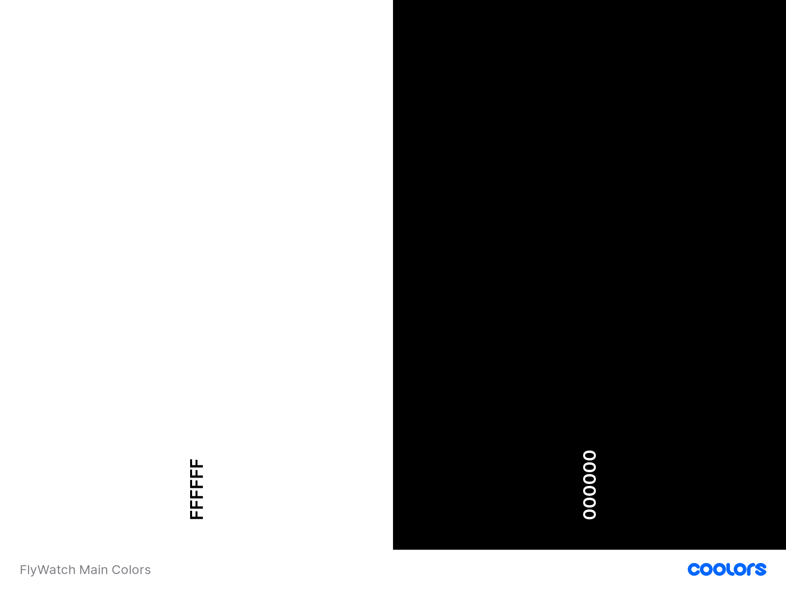
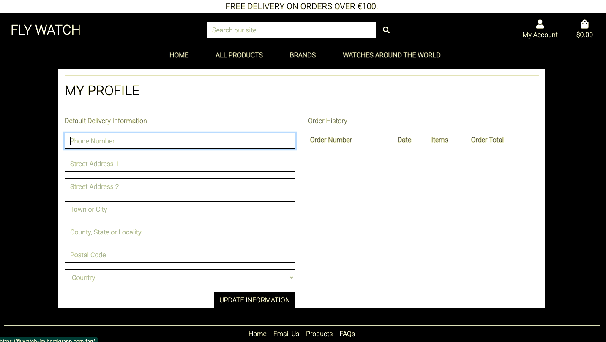
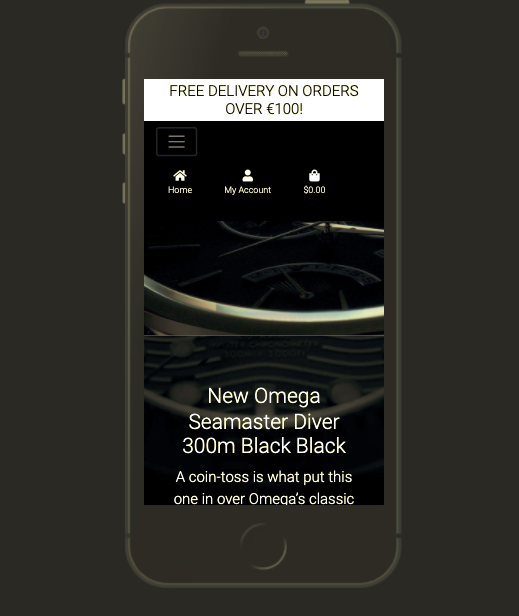
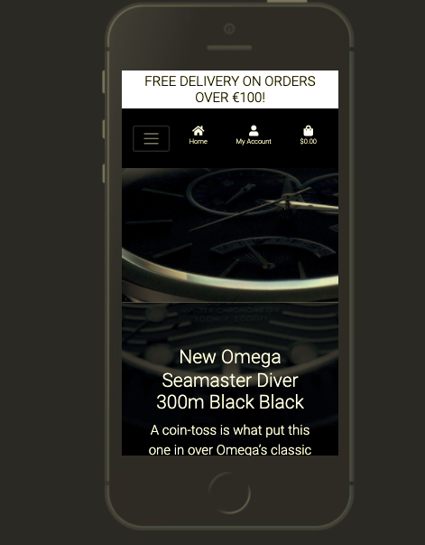

# **FlyWatch**


## **FlyWatch** 

Welcome to FlyWatch.

Come to our website to find the most exclusives watches in the market.
It works with Stripe to make the process easier and safer.

This is not an online store therefore, it will not process any order.
It's the final project from the code institute software development course.

If you have any feedback or questions, head over to my GitHub contact details and feel free to reach out to me.

---
<a></a>

## Table of contents 
* [UX](#ux)
    * [User Goals](#user-goals)
    * [User Stories](#user-stories)
    * [Site Owners Goals](#site-owners-goals)
    * [User Requirements and Expectations](#user-requirements-and-expectations)
        * [Requirements](#requirements)
        * [Expectations](#expectations)
    * [Design Choices](#design-choices)
        * [Fonts](#fonts)
        * [Colors](#colors)
        * [Structure](#structure)
* [Wireframes and Flowcharts](#wireframes-and-flowcharts)
    * [Wireframes](#wireframes)
    * [Flowcharts](#flowcharts)
    * [Database Structure](#database-structure)
* [Features](#features)
    * [Existing Features](#existing-features)
    * [Features to be implemented](#features-to-be-implemented)
* [Technologies used](#technologies-used)
    * [Languages](#languages)
    * [Libraries and Frameworks](#libraries-and-frameworks)
    * [Tools](#tools)
* [Testing](#testing)
* [Bugs](#bugs)
* [Deployment](#deployment)
    * [Local Deployment](#local-deployment)
    * [Heroku Deployment](#heroku-deployment)
* [Credits](#credits)

--- 

<a name="ux"></a>

## **UX**

<a></a>

### **User Goals**

The home page should be very attractive in order to take the possible customer to an order.
The webstore should work well on all devices.
The webstore should contain information of all producuts shown.
The payment should be easy, quick and safe.

<a></a>

### **User Stories**

As a user:

A user wants the webstore to be very attractive so they can make an order.
A user wants to have information on the products that is shown on the webstore.
A user wants to see any sale either on the product or for delivery.
A user wants to make a payment online with credit cards.
A user wants to look for watches based on price, brand or other category.

### **Site owners Goals**

As an owner:

The owner wants to sell the products available on the webstore.
The owner wants to make the webstore popular on the internet.
The owner wants to see all the orders made through the website.
The owner wants to be able to upload or delete a products on their website.
The owner wants to the possibility of updating a product on the website.

<a></a>

<a></a>

### **User Requirements and Expectations**

<a></a>

#### Requirements

The webstore has to be easy to be navigated on.
The webstore have to have colors with contrast.
The products on the website have to easy to be found.
Images of the products have to be up to date.

<a></a>

#### Expectations

The webstore will not have broken pages when displayed in differents devices such as tablets, iphones and laptops.
The webstore has to have its links working and that the links take the customer to the right and expected place.
Webstore is in line with the customer's journey.
The website has show the products prices and the prices updated when the customer change their order.

<a></a>

### **Design Choices**

The main colours of the webstore is black and white. 

I used the [Coolors](https://coolors.co/ "Coolors.co") to come up with the color pallette.

<a></a>

#### Colors

Main colors used for the webstore is:

- White (#fff)
- Black (#000)

 

Other than these main colors there are a few other colors that dont make huge difference to the website.

<a></a>

#### Fonts

The font used for this website was the 'Roboto' from [Google Fonts](https://fonts.google.com/ "Google Fonts").

<a></a>

#### Structure

The webstore will start with the land page which contains the navigation on top of the background image.
Other than land page, the website also has the following pages:

* ### Home Page
    The home page is the main page of the project. It has to big pictures on the background of the website. It has an appealing design which can bring possible customers to an order.

* ### All Products
    It's a page with all the products that the website can offer the customers. The user can also filter the search by price, rating and brands.

* ### Brands
    It's a page that takes the customer to a specific chosen brand by the customer.

* ### Watches Around the World
    This page is a mini blog which contains more details about 3 specific products.

* ### Product detail
    This page is a page with the specific details of a product chosen by the customer.

* ### Bag
    This page has the products details along the price and delivery information. The customer can also update the order or delete it. 

* ### Checkout
    This page the customer can go ahead the their order and place the order.


## **Wireframes and Flowcharts**

<a></a>

### **Wireframes**
I have used [Balsamic](https://balsamiq.com/wireframes/) to create wireframes for my webstore.
### [Desktop Wireframe](wireframes/desktop.png)
### [Tablet Wireframe](wireframes/tablet.png)
### [Phone Wireframe](wireframes/mobile.png)

### **Flowcharts**

To make the flowchart for the purchasing process I decided to use [Draw.io](https://draw.io/). The picture is down here below.


### **Database Structure**

For the project I set up 12 database Models which you can see in the image below. 
I have highlighted the relationships between the various models.


<a></a>

## **Features**

<a></a>

### **Existing Features**

* Registration and Sign in function through allauth package from Django
* 2 big background images on the home page to call the customer attention
* A small blog with a few products to add more value to the webstore
* Checkout page that allows customer to place an order
* The add products function that makes a superuser add or delete a product to the webstore.

The user can also check the order history to check the previous orders that they have made.

There is a function in the bag that saves the products that were not bought through cache.

<a></a>

### **Features to be implemented**

* A super promotion that calculates and shows on the screen depending on the number of items that are being putting in the bag.
* A function that finds the prices of watches from different places and try to show the product price depending on the actual store income.
* A function that takes the photo of customer wrist and show a picture of the customer wearing the watch on the screen.


<a></a>

## **Technologies used**

<a></a>

* [HTML](https://en.wikipedia.org/wiki/HTML)
* [CSS](https://en.wikipedia.org/wiki/Cascading_Style_Sheets)
* [JavaScript](https://en.wikipedia.org/wiki/JavaScript)
* [Python](https://www.python.org/)

<a></a>

### **Libraries and Frameworks**

* [Font Awesome](https://fontawesome.com/)
* [Bootstrap](https://getbootstrap.com/)
* [Google Fonts](https://fonts.google.com/)
* [jQuery](https://jquery.com/)
* [Stripe](http://stripe.com/)

### **Tools**

* [Django](https://www.djangoproject.com/)
* [Git](https://git-scm.com/)
* [GitPod](https://www.gitpod.io/)
* [Heroku](https://www.heroku.com/)
* [Balsamic](https://balsamiq.com/wireframes/)
* [W3C HTML Validation Service](https://validator.w3.org/)
* [W3C CSS Validation Service](https://jigsaw.w3.org/css-validator/)


<a></a>

## Testing

## Table of contents 
* [Homepage](#homepage)
* [Products](#rooms)
* [Checkout](#reservation)
* [Profile](#profile)
* [Navigation](#navigation)
* [Footer](#footer)

I have tested all the html files using [HTML Validator](https://validator.w3.org/).
I have tested all the CSS files using  [CSS Validator](https://jigsaw.w3.org/css-validator/).
I have tested all the JS files using [Javascript Validator](https://jshint.com/).

## Homepage
### **Responsiveness**
#### Where did I test?
I have tested the homepage on a few devices using inspect.
I have also tested how the home page display on microsoft edge and google chrome.

#### What did I test?
* Quality and display of hero image
* Display of carousel  
* Products on the bottom of the page

#### Conclusion
The 2 background images look good in all devices.
The carousel image from the blog page looks also good.  
The carousel from the blog page will not display on small screen which looks good.
Carousel resizes the height depending of the content of the slide.
The products on the bottom of the page had their url wrong. I have fixed the code adding the right url to them so they could show on the homepage.

 

### **Functionality**
Button 'Coming soon' on the home page works as it is expected to work taking the customer to the products page. 
Disabled carousel on the blog page for small screens. It looks better on big screens.  

The right/left carousel arrows work as it is expected to work. There are 2 pictures in this carousel.


### **User Experience**
#### User Story: The webstore has to be attractive so the customer can see themselves wearing the watches.
The big and close background image on the home pages gives the "fancy" feeling to the customer which can give high changes to a probable order.
When the user scroll down there is a second image that overflow the other image and gives the customer that feeling of surprise.


#### User Story: I want to have know some history about the products
There is a page on the webstore which is a small blog with a few products on it. It tells the story of specific products and it makes the customer feel a bit closer to the webstore.

## Products
### Responsiveness
#### Where did I test?

I have tested the page with the home products on all types of devices such as Desktop, tablet and iphone.


#### What did I test?
* The quality of the watches displayed on the products page
* Responsiveness of the additional information text

#### Conclusion
The products that are displayed on the products page are very in terms of image quality. They are displayed with col-lg-4 when displayed in big screens and then the number of products shown on the page are reduced according to the size of the screen that they are displayed on.
The numbers and information are very clear and very proportional to the size of the sreen.


### Functionality
In order to make the products being displayed very well distribuited on the page, I have decided to use the row and col systems which makes the number of items on each page being calculated according to the size of the device screen.

## Checkout
### Responsiveness
#### Where did I test?
I have tested the page with the home products on all types of devices such as Desktop, tablet and iphone.

#### What did I test?
#### Step 1: Select the watch to buy
* Image quality of the product displayed on the page.
* Correct product info being displayed.

#### Step 2: Display of the product after being in the checkout bag
* Display of data information from step 1.
* Availability of chaging the number of watches.


#### Step 3: Show checkout form to the customer
* Checkout form being displayed with all information to be filled out.
* Order summary being displayed on the page to let the customer know what they are buying.


#### Step 4: Show the order details after placing an order
* Show customer the order details.


#### Conclusion
The quality of products being displayed on the checkou page is outstanding.
The products are easy to be manipulated in terms of updating the number of watches that the customer want to go ahead placing the order.
If the customer wants to change the quantity of watches that they want to buy, the whole information about the order will change automatically being displayed on the page. It gives the customer more trust on the website.
The checkout form is also displayed well on the checkout page. The form is a crispy form which is easier to have the website being built on.
The bag app had a few templates created in order to make the display of the form better organised on different device screens.
The order details is also shown well on the page after the order is placed successfully.


### Functionality
#### Step 1: Select the watch to buy
* Flash message when the customer adds a watch to the checkout bag.
* Product info being displayed right on the page through the function in the app.

#### Step 2: Display of the product after being in the checkout bag
* Product is displayed on the page with the correct info.
* Option to update or delete are displayed on the page.
* Flash message if the customer either delete or update the order.

#### Step 3: Show checkout form to the customer
* Checkout form is shown on the page after the customer choose the product that they want.
* Order summary is also displayed on the page.
* The crispy form is the form that shows on the page and it contains function to not allow the customer go ahead with the order if there is some important information missing.
* The form will be auto filled if the customer has already an account registered with the webstore.

#### Step 4: Show the order details after placing an order
* Order details are show on the page after the order goes through.


## Profile
### Responsiveness
#### Where did I test?
I have tested the page with the home products on all types of devices such as Desktop, tablet and iphone.

#### What did I test?
* Profile form
* Right information being displayed on the page
* Order history


#### Conclusion
The profile page is supposed to show the customer details after they added their own information to the website.
It also supposed to show the customer order history on the page which can remind the customer of a specific order and then the change of repeating that same order.

### Functionality
The customer information is displayed on the website if the customer is already registered on the website.
If the customer is a new the form will be there to be filled out and then in the next time when the customer places an order, their details will be saved.
The order history is there also to let the customer know about their last orders.

 

## Navigation 
### Responsiveness
#### Where did I test?
I have tested the page with the home products on all types of devices such as Desktop, tablet and iphone.

#### What did I test?
* Display of nav links on large devices
* Display of hamburger icon and the links
* Buttons throughout the website 

#### Conclusion
The navigation looks very well organised on big screens. On small screens the navigation happend to look a little bit off because of the size of nav links on the nav.

 

The buttons look very organised and there is a good contrast between the buttons and the background page which makes the buttons very presentable.

### Functionality
The navbar works well on all devices screens. All the links in the navbar work taking the customer to the right places. 
The navbar collapses in a good way which makes the website very smooth.
The issue presented above happened because of the size of the nav links. I left these nav links with a smaller size and they got to fit well in the navbar.



## Footer 
### Responsiveness
#### Where did I test?
I have tested the page with the home products on all types of devices such as Desktop, tablet and iphone.

#### What did I test?
* Responsiveness
* The links in the footer

#### Conclusion
The footer works pretty well in all devices. Its a simple footer with 4 links. All 4 links take to 4 different pages.

### Functionality
Beside the footer responsiveness working well on all screens, the links do their job also. The first home link takes the customer to the home page. The secodn link is a link that takes the customer straight to their mail app to email the webstore. The third link is a link to the products page and then the last link is link to the webstore FAQ.


## **Deployment**

### Local Deployment

The project was created using Github, from there I used [Gitpod](https://gitpod.io/) to write my code. 
The project was created using command "git commit -m '' ".
And then the project was deployed using Heroku.

This project was also created an account on Stripe where the customer will be able to use in order to place the orders.


To clone the project: 

1. Go to the application's repository and then download the zip of the repository. 
    Or you can also clone the repository following the line below:
    ``` 
    git clone https://github.com/JoseMachado-CE/Fly-Watch.git
    ``` 

2. Access the requirement folder through your terminal window and follow the line below:
    ```
    pip3 install -r requirements.txt
    ```

3. In your IDE environment variables or in env.py" if you want to have the variables below:
    ```
    import os

    os.environ["SECRET_KEY"] = "YOUR_SECRET_KEY"
    os.environ["DEVELOPMENT"] = "True"

    os.environ["DEFAULT_FROM_EMAIL"] = 'DEFAULT_FROM_EMAIL'

    os.environ["STRIPE_PUBLIC_KEY"] = "STRIPE_PUBLIC_KEY"
    os.environ["STRIPE_SECRET_KEY"] = "STRIPE_SECRET_KEY"
    os.environ["STRIPE_WH_SECRET"] = "STRIPE_WH_SECRET"
    os.environ["STRIPE_CURRENCY"] = "EUR"

    ```
    

    If you plan to go ahead created env.py make sure to add it to > .gitignore file.

1. Migrate database using the line below:
    ```
    python3 manage.py migrate
    ```
1. Create a superuser using line below:
    ```
    python3 manage.py createsuperuser
    ```
1. You can run the project using running the line below:
    ```
    python manage.py runserver
    ```
    The address to access the website is displayed in the terminal  
    Add /admin to the end to access the admin panel with your superuser credentials

    
### Heroku Deployment 

1. Login to your heroku account and create your app. 
1. Once you have app created you can look for the heroku Postgress to attach a postgress DB to your project. 
    
1. Now you go to 'settings' and then click on the "Reveal config vars" button. Set up the same variables as in either your env.py or on gitpod settings variables.:
 

    ```
    AWS_ACCESS_KEY_ID = "AWS_ACCESS_KEY_ID"
    AWS_SECRET_ACCESS_KEY = "AWS_SECRET_ACCESS_KEY"
    AWS_S3_REGION_NAME = "AWS_S3_REGION_NAME"
    AWS_STORAGE_BUCKET_NAME = "AWS_STORAGE_BUCKET_NAME"
    USE_AWS = True
    
    DATABASE_URL = "This variable is automatically set when adding the Postgres Add on"

    SECRET_KEY = "SECRET_KEY"

    STRIPE_PUBLIC_KEY = "STRIPE_PUBLIC_KEY"
    STRIPE_SECRET_KEY = "STRIPE_SECRET_KEY"
    STRIPE_WH_SECRET = "STRIPE_WH_SECRET"
    STRIPE_CURRENCY = EUR

    DEFAULT_FROM_EMAIL = "DEFAULT_FROM_EMAIL"
    EMAIL_HOST = "smtp.gmail.com"
    EMAIL_HOST_PASS = "EMAIL_HOST_PASS"
    EMAIL_HOST_USER = "EMAIL_HOST_USER"
    EMAIL_PORT = 587
    EMAIL_USE_TLS = True
    ```

1. Then you go to your project app settigs file and comment out the default database and and the lines belo:
    ```
    DATABASES = {
        'default': dj_database_url.parse('Put your DATABASE_URL here'))
    }
    ```
1. Migrate again with the following command
    ```
    python3 manage.py migrate
    ```


1. And then create a superuser for the postgres database in order to get access to Django admin.
    ```
    python3 manage.py createsuperuser
    ```

    --> Make sure to check the boxes "verify" and "primary" on django admin.

1. After this you can load the data into your newly created database by using the following command: 

    ```
    python3 manage.py loaddata <name of file containing the data *>
    ``` 


1. After migrations are complete, change database configurations to:
```
    if 'DATABASE_URL' in os.environ:
        DATABASES = {
            'default': dj_database_url.parse(os.environ.get('DATABASE_URL'))
        }
    else:
        DATABASES = {
            'default': {
                'ENGINE': 'django.db.backends.sqlite3',
                'NAME': os.path.join(BASE_DIR, 'db.sqlite3'),
            }
        }
```
This set up will allow your site to use Postgres in deployment and sqlite3 in development.


1. Make sure you have your requirements.txt file and your Procfile. In case you don't, follow the below steps:
    Requirements:
    ```
    pip3 freeze --local > requirements.txt
    ```
    Procfile:
    ```
    echo web: python app.py > Procfile
    ```
1. The Procfile should contain the following line:
    ```
    web: gunicorn <project_name>.wsgi:application

    ```

1. Add your files and commit them to GITHUB by running the following commands:
    ```
    git add . 
    git commit -m "Your commit message"
    git push
    ```

1. Add your Heroku app URL to ALLOWED_HOSTS in your settings.py file
1. Disable collect static so that Heroku doesn't try to collect static files when you deploy by typing the following command in the terminal
    ```
    heroku config:set DISABLE_COLLECTSTATIC=1
    ```
1. Go back to HEROKU and click "Deploy" in the navigation. 
1. Scroll down to Deployment method and Select Github. 
1. Look for your repository and click connect. 
1. Under automatic deploys, click 'Enable automatic deploys'

1. Just beneath, click "Deploy branch". Heroku will now start building the app. When the build is complete, click "view app" to open it.
1. In order to commit your changes to the branch, use git push to push your changes. 


1. Store your static files and media files on AWS. You can find more information about this on [Amazon S3 Documentation](https://docs.aws.amazon.com/AmazonS3/latest/userguide/Welcome.html).
    If you would like to follow a tutorial instead, visit [this tutorial on Youtube from Amazon Web Services](https://youtube.com/watch?v=e6w9LwZJFIA)

1. Set up email service to send confirmation email and user verification email to the users. You can do this by following the next steps (Gmail only)

(Be aware that this migth be different for other providers or the process might have changed over time)

* Go to your email account and go to your account settings
* Under Security, scroll down to Signing in to Google and make sure 2 step verification is turned on
* Under the same heading (Signing in to Google) you will see the 'App passwords' option.
* Click on the option, select mail for the app and under device type select other and fill in 'Django'
* You will now get a password which you should copy and set it as a config variable in Heroku:

```
    EMAIL_HOST_PASS = 'Password you just copied'
    EMAIL_HOST_USER = 'Your gmail account
```
* Go to your settings.py in casa_pedra_nobre directory and add the following:

```
    if "DEVELOPMENT" in os.environ:
        EMAIL_BACKEND = 'django.core.mail.backends.console.EmailBackend'
        DEFAULT_FROM_EMAIL = os.environ.get('DEFAULT_FROM_EMAIL')
    else:
        EMAIL_BACKEND = 'django.core.mail.backends.smtp.EmailBackend'
        EMAIL_USE_TLS = True
        EMAIL_PORT = 587
        EMAIL_HOST = 'smtp.gmail.com'
        EMAIL_HOST_USER = os.environ.get('EMAIL_HOST_USER')
        EMAIL_HOST_PASSWORD = os.environ.get('EMAIL_HOST_PASS')
        DEFAULT_FROM_EMAIL = os.environ.get('DEFAULT_FROM_EMAIL')
```


[Back to Top](#table-of-contents)

<a></a>


